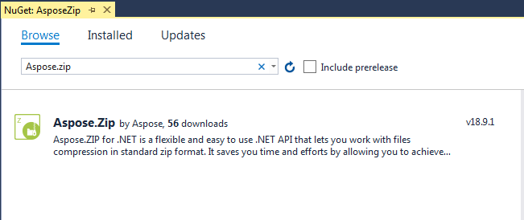
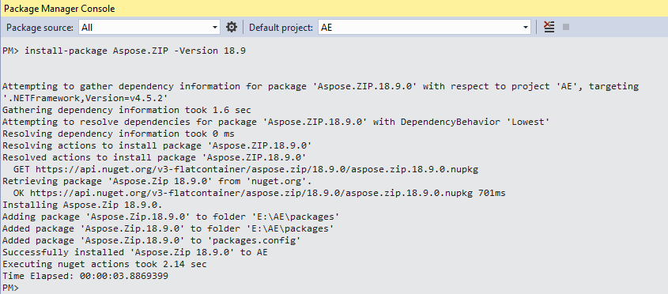
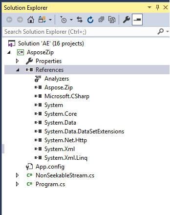

## **Installing Aspose.ZIP for .NET through NuGet**
NuGet is the easiest way to download and install Aspose APIs for .NET. Open Microsoft Visual Studio and NuGet package manager. Search "aspose" to find the desired Aspose API. Click on "Install", the selected API will be downloaded and referenced in your project.

## **Install or Update Aspose.ZIP using the Package Manager Console**
You can follow the steps below to reference the Aspose.ZIP API using the package manager console:

1. Open your solution/project in Visual Studio.
1. Select Tools -> Library Package Manager -> Package Manager Console from the menu to open the package manager console.

Type the command “**Install-Package Aspose.ZIP-Version x.x.0**” and press enter to install the latest full release into your application. Alternatively, you can add the "**-prerelease**" suffix to the command in order to specify that the latest release including hotfixes is to be installed as well.

If you are not familiar with the [Aspose EULA](http://www.aspose.com/corporate/purchase/end-user-license-agreement.aspx) then it is a good idea to read the license referenced in the URL. 

You should now find that Aspose.ZIP has successfully been added and referenced in your application for you.

In the package manager console, you can also use the command “**Update-Package Aspose.ZIP.NET**” and press enter to check for any updates to the Aspose.ZIP package and install them if present. You can also add the "-prerelease" suffix to update the latest release.
## **Referencing the Component**
In order to use any component in your application, add a reference to it. The following steps describe what to do when you use Visual Studio .NET.

1. In the Solution Explorer, expand the project node you want to add a reference to.
1. Right-click the **References** node for the project and select **Add Reference** from the menu.
1. In the Add Reference dialog box, select the **.NET** tab (it's usually selected by default).
1. If you have used the MSI installer to install Aspose.ZIP, you will see Aspose.ZIP in the top pane. Select it and then click the **Select** button.
1. If you have downloaded and unpacked the DLL only, click the **Browse** button and locate the Aspose.ZIP.dll file. 
   You have referenced Aspose.ZIP and it should appear in the **SelectedComponents** pane of the dialog box.
1. Click **OK**. 
   An Aspose.ZIP reference appears under the **References** node of the project.
## **Uninstalling Aspose.ZIP for .NET**
If you have used MSI installer to deploy Aspose.ZIP, follow these steps to completely remove the component and the associated demos and documentation:

1. From the **Start** menu, select **Settings** followed by **Control Panel**.
1. Click **Add/Remove Programs**.
1. Select **Aspose.ZIP**.
1. Click the **Change/Remove** button to remove Aspose.ZIP.
